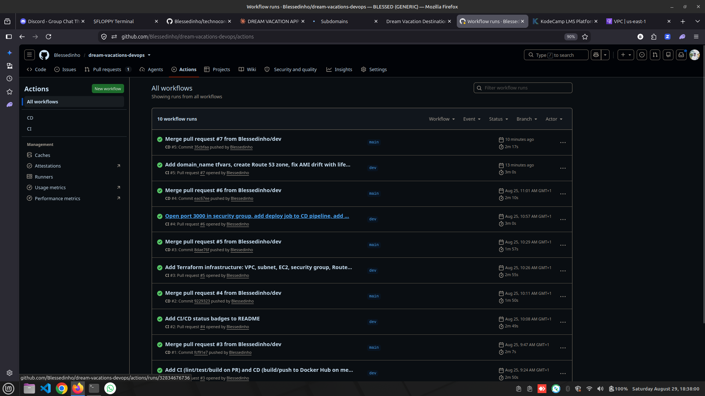
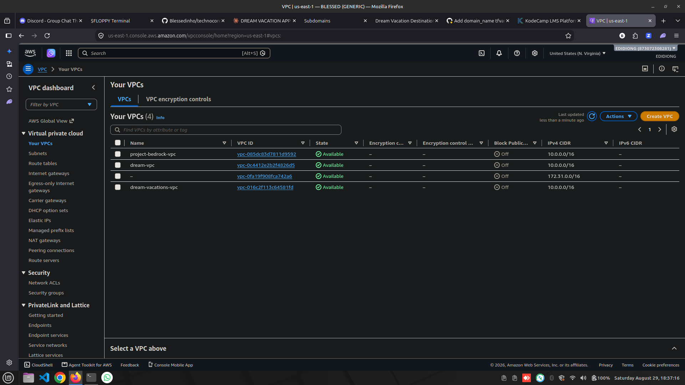
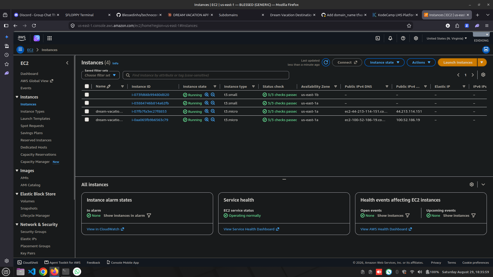
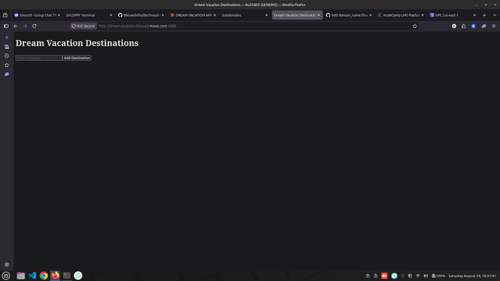

# Dream Vacations — DevOps Capstone


## Project Overview

Dream Vacations is a full-stack travel booking web application. This repo
covers the complete DevOps lifecycle for taking the app from source code to
a production-ready, containerized, automatically deployed, and HTTPS-secured
service on AWS.

**Stack:**
- **Frontend:** React (customer-facing booking interface)
- **Backend:** Node.js / Express (REST API)
- **Database:** PostgreSQL

**Live demo:** https://dreamvacations-blessed.mooo.com

## Architecture Diagram
                    ┌─────────────────────────┐
                    │   GitHub Repository      │
                    │  (main / dev branches)   │
                    └────────────┬─────────────┘
                                 │ PR + merge
                                 ▼
                    ┌─────────────────────────┐
                    │   GitHub Actions CI/CD    │
                    │  CI: lint, test, build   │
                    │  CD: build, push, deploy │
                    └────────────┬─────────────┘
                                 │ push images
                                 ▼
                    ┌─────────────────────────┐
                    │       Docker Hub          │
                    │  backend + frontend imgs  │
                    └────────────┬─────────────┘
                                 │ pull
                                 ▼
    ┌───────────────────────────────────────────────────┐
    │                AWS (via Terraform)                  │
    │  VPC → Subnet → IGW → Route Table                   │
    │  ┌─────────────────────────────────────────────┐   │
    │  │  EC2 (Ubuntu)                                 │   │
    │  │   Nginx (reverse proxy, SSL via Certbot) :443 │   │
    │  │     ├── React frontend container      :3000   │   │
    │  │     ├── Node.js backend container     :3001   │   │
    │  │     └── PostgreSQL container           :5432  │   │
    │  └─────────────────────────────────────────────┘   │
    │  Route 53 hosted zone (provisioned via Terraform)    │
    └───────────────────────────────────────────────────┘
                                 ▲
                                 │ A record
                    ┌─────────────────────────┐
                    │  FreeDNS (mooo.com)      │
                    │  dreamvacations-blessed. │
                    │  mooo.com → EC2 IP       │
                    └─────────────────────────┘

## Setup Instructions (Local Development)

```bash
git clone https://github.com/Blessedinho/dream-vacations-devops.git
cd dream-vacations-devops

# Create a .env file (see .env.example for the required variables)
cp .env.example .env

# Run the full stack
docker compose up --build
```

- Frontend: http://localhost:3000
- Backend: http://localhost:3001
- Database: localhost:5432

---

## 1. Git & Repository Workflow

- Repository initialized from scratch (not forked) from the original
  `Dream-Vacation-App` codebase, with `main` and `dev` branches.
- **Branch protection** on `main` via a GitHub Ruleset:
  - Requires a pull request before merging (1 approval required)
  - Requires CI status checks (`Backend Lint, Test & Build`,
    `Frontend Lint, Test & Build`) to pass before merging
  - Blocks force pushes and branch deletion
  - Repository admins can bypass in solo-developer circumstances; in a real
    team, a teammate would provide the required review/approval.
- All work happens on `dev`, merged into `main` exclusively via pull request.

## 2. Linux & Shell Scripting

Two idempotent shell scripts live in `scripts/`:

- **`scripts/setup-env.sh`** — installs Docker, the Docker Compose plugin,
  and Node.js if not already present. Safe to re-run; each step checks
  whether the tool is already installed before attempting installation.
- **`scripts/backup-db.sh`** — backs up the PostgreSQL database from the
  running `dreamvacation-db` container using `pg_dump`, compresses it,
  rotates backups older than 7 days, and rotates its own log file once it
  exceeds 1MB. Fails loudly (non-zero exit) if the `.env` file or database
  container is missing.

Both are executable (`chmod +x`) and use `set -euo pipefail` for safe
failure behavior.

## 3. Containerization with Docker

- `backend/Dockerfile` — Node 18 Alpine image, installs dependencies, runs
  `npm start`.
- `frontend/Dockerfile` — multi-stage build: Node 18 Alpine build stage
  compiles the React app, served by an `nginx:alpine` production stage.
- Database uses the official `postgres:16` image directly — no custom
  Dockerfile needed.

## 4. Docker Compose

`docker-compose.yml` runs all three services (frontend, backend, db) on a
shared bridge network (`dream-network`), configured entirely via a `.env`
file (see `.env.example`). Verified to run end-to-end locally with:

```bash
docker compose up --build
```

## 5. CI/CD with GitHub Actions

Two workflows in `.github/workflows/`:

- **`ci.yml`** — runs on every pull request targeting `main` or `dev`.
  Installs dependencies, lints, runs tests, and does a sanity Docker build
  for both backend and frontend, independently.
- **`cd.yml`** — runs on every push to `main` (i.e. after a PR merge):
  1. `build-and-push` — builds both Docker images and pushes them to Docker
     Hub, tagged with both the commit SHA and `latest`.
  2. `deploy` — copies `docker-compose.prod.yml` to the EC2 instance via
     SCP, then SSHes in, pulls the latest images, and restarts the stack
     with `docker compose up -d`.

Status badges for both workflows are shown at the top of this README.

**Pipeline in action:**


## 6. Infrastructure with Terraform (AWS)

All infrastructure is defined as code in `terraform/`:

- `vpc.tf` — VPC, public subnet, internet gateway, route table + association
- `ec2.tf` — security group (SSH/HTTP/HTTPS/app ports) and the EC2 instance
  itself, using a `data "aws_ami"` lookup for the latest Ubuntu 22.04 LTS
  (with a `lifecycle { ignore_changes = [ami] }` guard — see debugging notes)
- `key_pair.tf` — SSH key pair generated entirely by Terraform (`tls`
  provider), registered with AWS, and saved locally
- `route53.tf` — Route 53 hosted zone and A record, conditional on a
  `domain_name` variable being set
- `variables.tf` / `outputs.tf` — all values (region, CIDR blocks, instance
  type, project name, domain) are variables with sensible defaults, and key
  resource attributes (IP, instance ID, nameservers, private key) are
  exposed as outputs for reuse in CI/CD and documentation

**Remote state:** stored in a versioned S3 bucket, configured in
`providers.tf`, so state persists safely across local and CI/CD runs.

```hcl
terraform {
  backend "s3" {
    bucket = "dream-vacations-tfstate-<timestamp>"
    key    = "dream-vacations/terraform.tfstate"
    region = "us-east-1"
  }
}
```

**VPC & Subnet (created via Terraform):**


**EC2 instance running:**


## 7. Deployment to AWS

**Beginner path used:** SSH into the Terraform-provisioned EC2 instance and
run Docker Compose, fully automated via the `deploy` job in `cd.yml`
described above. The app is confirmed accessible via the instance's public
IP and, since Phase 8/9, via its domain over HTTPS.

## 8. Domain & DNS Setup

A Route 53 hosted zone is provisioned via Terraform (`route53.tf`) to
satisfy the infrastructure-as-code requirement. However, as of 2026, free
domain registrars that support delegating nameservers to an external DNS
provider like Route 53 (e.g. Freenom) have shut down or become unreliable —
confirmed by testing FreeDNS/afraid.org, which only supports managing DNS
records *within* their own system, not NS delegation to a different
provider.

**Practical workaround used:** a free subdomain,
`dreamvacations-blessed.mooo.com`, was registered via FreeDNS
(freedns.afraid.org) with a direct A record pointing at the EC2 instance's
public IP. This provides a real, working domain name for the live
deployment and for issuing a genuine Let's Encrypt SSL certificate, while
the Route 53 hosted zone remains provisioned via Terraform to demonstrate
that specific skill.

## 9. Nginx & SSL Configuration

Nginx and Certbot are installed automatically via the EC2 instance's
Terraform `user_data` script. Nginx is configured as a reverse proxy:

```nginx
server {
    listen 80;
    server_name dreamvacations-blessed.mooo.com;

    location / {
        proxy_pass http://localhost:3000;
        proxy_set_header Host $host;
        proxy_set_header X-Real-IP $remote_addr;
        proxy_set_header X-Forwarded-For $proxy_add_x_forwarded_for;
        proxy_set_header X-Forwarded-Proto $scheme;
    }

    location /api/ {
        proxy_pass http://localhost:3001/;
        proxy_set_header Host $host;
        proxy_set_header X-Real-IP $remote_addr;
        proxy_set_header X-Forwarded-For $proxy_add_x_forwarded_for;
        proxy_set_header X-Forwarded-Proto $scheme;
    }
}
```

SSL was issued with:

```bash
sudo certbot --nginx -d dreamvacations-blessed.mooo.com
```

Certbot automatically configured HTTP→HTTPS redirection and installed a
systemd timer (`certbot.timer`) for automatic renewal, confirmed working via:

```bash
sudo certbot renew --dry-run
```

The app is live and fully functional at:
**https://dreamvacations-blessed.mooo.com**

**App running live with valid HTTPS:**


---

## Debugging Notes (Lessons Learned)

A few real issues hit and resolved during this build, kept here because
they're genuinely useful to remember:

- **Silent remote-state divergence:** in an earlier related project, an S3
  backend block was added locally but never committed, causing CI to
  silently reinitialize an empty backend and attempt to recreate all
  infrastructure from scratch on every run. Fixed by always verifying
  `git show HEAD:path/to/file` matches what's actually applied locally, not
  just trusting the local working directory.
- **AMI drift forcing instance replacement:** using
  `data "aws_ami" "ubuntu" { most_recent = true }` is great for the first
  `apply`, but on every subsequent `plan`, AWS may have released a newer
  AMI, which Terraform then wants to apply — forcing a full destroy/recreate
  of the EC2 instance (new IP, broken DNS, invalidated SSL cert). Fixed by
  adding `lifecycle { ignore_changes = [ami] }` to the instance resource.
- **Security group scope:** a container running and reachable via
  `docker ps`/`curl` from inside the server is not the same as being
  reachable externally — a missing security group ingress rule (port 3000)
  caused the frontend to be unreachable from the browser despite the
  container being perfectly healthy.
- **SSH key secret formatting:** GitHub Secrets store values verbatim — an
  `EC2_SSH_KEY` secret pasted without its full
  `-----BEGIN/END RSA PRIVATE KEY-----` markers fails with
  `ssh: no key found`, even though the key file itself is valid.
- **Free domain registrars are effectively gone:** Freenom (the classic
  "free domain" provider) shut down in 2024. Free DNS services like
  afraid.org only manage records within their own system and do not support
  delegating nameservers to an external provider like Route 53 — a real
  constraint worth knowing before assuming a fully-free custom-domain path
  is available.

## Deliverables Checklist

- [x] Frontend and backend code
- [x] Dockerfiles and Docker Compose file
- [x] Shell scripts (env setup, DB backup/log rotation)
- [x] GitHub Actions workflows (CI + CD)
- [x] Terraform configuration (VPC, EC2, security groups, Route 53, remote state)
- [x] Nginx config
- [x] README with instructions and demo link
- [x] Live app deployed on AWS, accessible via HTTPS with a custom domain
